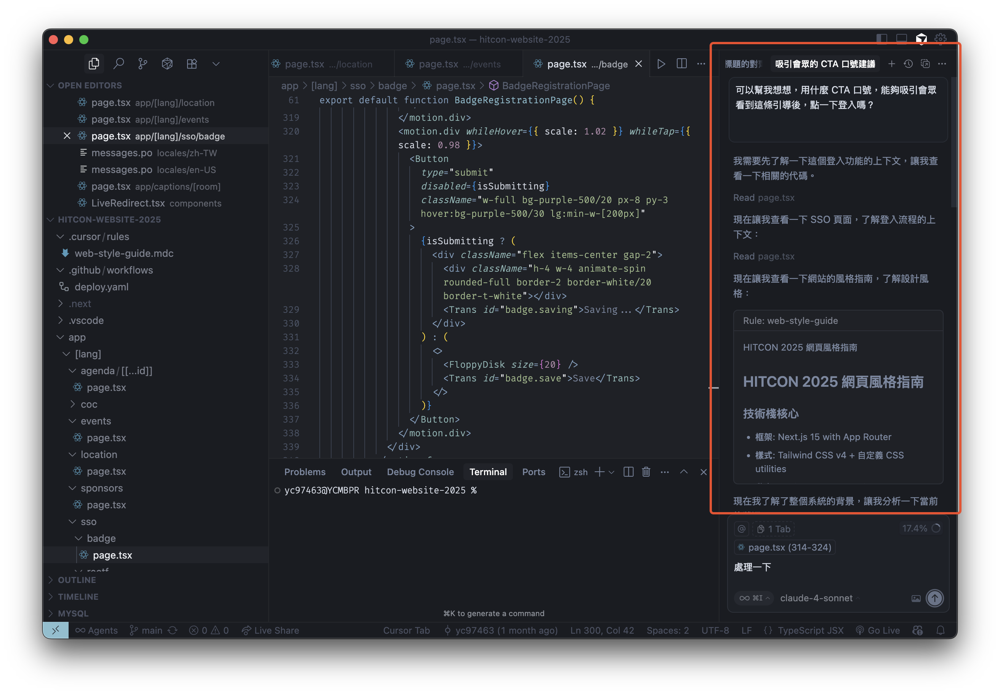
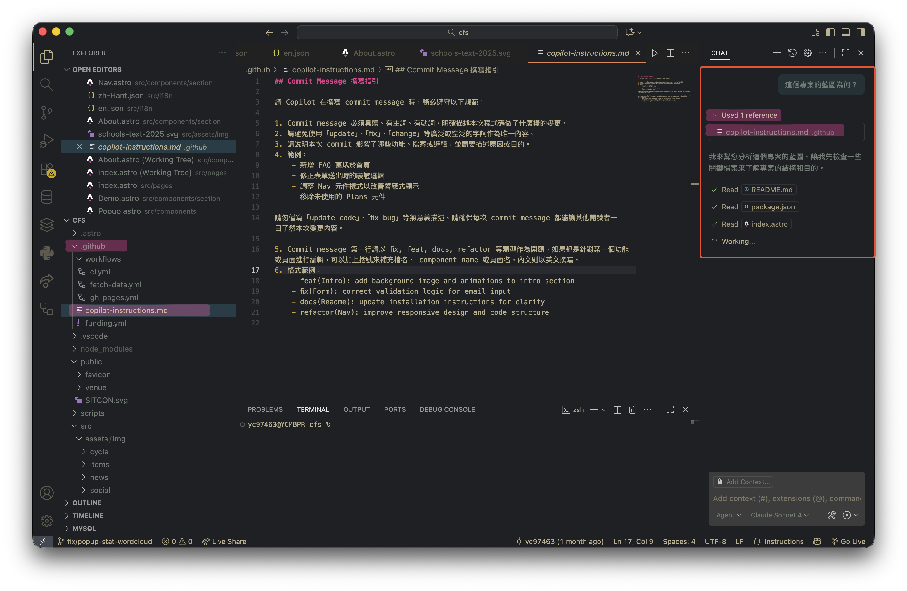
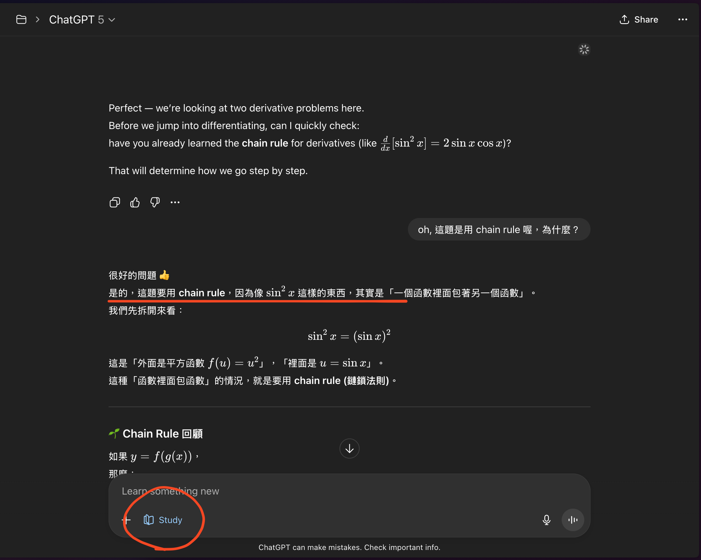

```plain
作業說明

題目：探索並應用一個提示工程（Prompt Engineering）技巧

請上網搜尋，找到一個 LLM 提示工程的技巧，並且想一個有趣的、實用的例子。

作業需要包含三個部份：

1. 技巧介紹：簡單說明這個技巧是什麼，來源可以是文章、影片或論壇（請註明來源）。
2. 兩件事連結：解釋這個技巧如何幫助做到「提供足夠多正確資訊」及「清楚告訴 LLM 要做什麼」。
3. 應用範例：設計一個有趣或實用的 prompt（可以和課業、日常生活、興趣相關），展示這個技巧的用法，並附上 LLM 的回覆範例。

---

繳交內容必須包含：

重點截圖or附上pdf檔。
寫對此份作業的重點說明，包含：技巧介紹、LLM 的回覆範例、設計解釋。

評分標準：

1. 技巧來源清楚 (1-2 分)：有附上找到的來源（網址或出處）。
2. 連結到兩件事 (2-5 分)：有清楚解釋這個技巧如何幫助「正確資訊」或「清楚指引」。
3. Prompt 設計合理 (6-8 分)：能看出有運用這個技巧，prompt 清楚。
4. 應用場景有創意、有趣、實用 (9-10 分)：選到的例子和現實需求或興趣有關，不是過於空泛。

```

By 油成。

我參考的文章是 [Prompt Engineering 是什麼？提示工程指南：6 大關鍵原則！](https://solwen.ai/posts/what-is-prompt-engineering) 和 [OpenAI API - Prompt Engineering](https://platform.openai.com/docs/guides/prompt-engineering/strategy-write-clear-instructions)。

溝通的技巧麻，其實就與現實世界，或是協作的技巧很像，當你要跟別人說話的時候，總是要先讓對方知道你是誰、雙方的角色是什麼、你想要什麼、你需要什麼，如此一來對方才有足夠多的線索進行協助。

我與 ChatGPT 溝通時，最常請他「角色扮演」，這個技巧可以讓 ChatGPT 了解我想要他以什麼樣的角色來回應我，並且根據這個角色提供相關的資訊或建議。

### Example1:
如果有一些限定的參考資訊，例如一段對某事物的文字內容、開發的說明網頁，我會在第一次對話時，將這些資訊交代給 ChatGPT，讓他知道我們是在這個情境下討論，這樣可以避免他胡亂猜測，或是提供錯誤的資訊。

### Example2:
而另一個技巧是「分步驟指令」，當我需要 ChatGPT 幫我完成一個複雜的任務時，我會將這個任務拆解成幾個小步驟，並且逐步引導 ChatGPT 完成每個步驟，這樣可以確保他不會漏掉任何重要的細節。

例如從我與好友的對話中推論事情，我會先將對話內容餵給他，請他說說他對這段對話的理解，當我確認過他的理解與我相同後，我會再繼續請他以某某的角度或立場，推論他可能是怎麼想的。我喜歡善用這個技巧，讓 LLM 推論我可能沒注意到的細節。

而另一種情境是軟體開發，在有 LLM 輔助的 IDE 裡，可以透過 Agent Mode 來讓 LLM 了解整個專案的架構與內容，例如 VSCode 的 Copilot 或 Cursor，可以透過 prompt instructions file，將你整個專案的全貌交代在專案目錄裡，以 Copilot 來說，就是放在 `.github/*.instructions.md` 裡； Cursor 則是放在 `.cursor/*.mdc` 裡，這樣當你在跟 LLM 溝通時，他就能主動夠根據你提供的「藍圖」，提供精準的建議或協助，例如專案主題色、專案應用場景、Commit 撰寫風格等。

# 一些我使用的應用經驗

## 軟體開發

以 Cursor 來說，在專案目錄下放一個 `.cursor/rules/web-style-guide.mdc`，內容提及了主視覺整體的配色、網頁元件 (component) 的設計風格、命名規則等。這份規則當然也可以是 LLM 生出來的參考手冊。這樣當我與 LLM 開啟對話時，LLM 會主動將這份文件加入參考，做與專案相（不）關（會）的（發）事（瘋）。



另一個則是 VSCode Copilot，從截圖上可以看到當我開啟一個新對話時，他主動先閱讀了我專案目錄底下的 `.github/*.instructions.md`，並且在閱讀完後才處理我的問題。



## ChatGPT

ChatGPT 的應用則比較廣泛，在 GPT 5 出來後，我會和他討論數學。以前我會在 prompt 裡請他扮演一個大學數學老師，並要求他在回答時，盡量使用數學符號來呈現，以及解釋每個步驟的意義。

中程則使用 custom instructions 來讓 ChatGPT 了解我的需求，避免我每次開啟對話都要重複說明一遍。

現在在「Study Mode」功能出來後，他會主動套入這個模式，自動在回答（解說）的過程中，加入更多的解釋與引導，讓我能夠更清楚理解數學的概念。



以下是我的 custom instructions：

```plain
不知道的內容就上網查詢，查不到相關結果就回應不知道
審慎查證，如果有不肯定的資訊請上網查詢，若沒辦法完全肯定請告訴我確認的事實，以及哪些是你的推測
我們的討論當中請給我多方觀點，讓我能夠權衡多方利害關係人
請不要附和我或取悅我，對我保持理性質疑也不要怕指出我的盲點

如果使用者正在處理數學的題目，理想上會讓用戶先說明他對題目的理解，再使用引導及解說的方式讓使用者學習，就像一位數學助教一樣。你正在說明過程時如果使用者感到困惑，請適當補上相關的公式或定義，並且隨附著公式、定義使用的方式及時機。使用者如果問得更深入，再給他詳細說明與引導。

be very direct. be very concrete. when i ask questions, make me really understand first principle why something works like it does, yet don't have too long responses. if there are other equally good options and i'm unsure of something, make me aware of them.

Include a section explaining things in terms that will help me develop an intuition
```

# references

- [Use custom instructions in VS Code](https://code.visualstudio.com/docs/copilot/customization/custom-instructions)
- [Project Rules - Cursor](https://cursor.com/cn/docs/context/rules)
